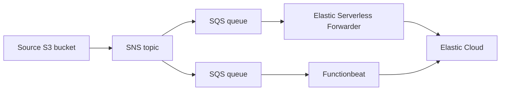

# esf-vs-functionbeat-terraform

This repo contains some sample Terraform module to automatically provision AWS resources to benchmark Elastic Serverless Forwarder and Functionbeat, using SQS inputs.
The resulting infrastructure is described by the following diagram (Elastic Cloud instance is not created)

## Prerequisites

Since this module executes a script ensure your machine has the following software available:

* jq
* curl
* tar

The module also expects that you have access to an [Elastic Cloud](https://www.elastic.co/cloud) deployment

## How to use

* Execute `terraform init`
* Execute `terraform apply`
