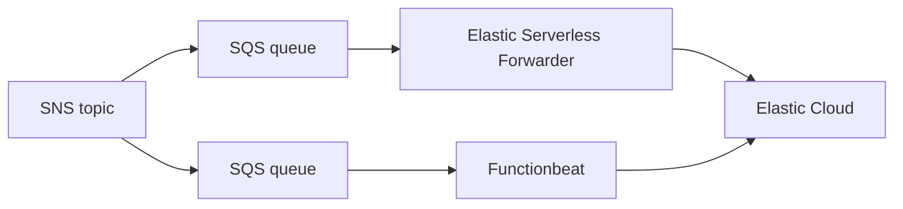

# esf-vs-functionbeat-terraform

This repository contains sample Terraform code designed to automate the provisioning of AWS resources necessary for benchmarking the performance of Elastic Serverless Forwarder (ESF) and Functionbeat. Both ESF and Functionbeat are configured to utilize SQS inputs for the benchmarking process. The diagram provided below illustrates the resulting infrastructure. Please note that the creation of Elastic Cloud deployments is not carried out.

## Prerequisites

Since this module executes a script ensure your machine has the following software available:

* jq
* curl
* tar

The module also expects that you have access to an [Elastic Cloud](https://www.elastic.co/cloud) deployment and that Docker is installed and running.

## How to use

* Define secrets and variables in `*.auto.tfvars` files (See `variables.tf` for the list of variables declared)
* Execute `terraform init`
* Execute `terraform apply`
